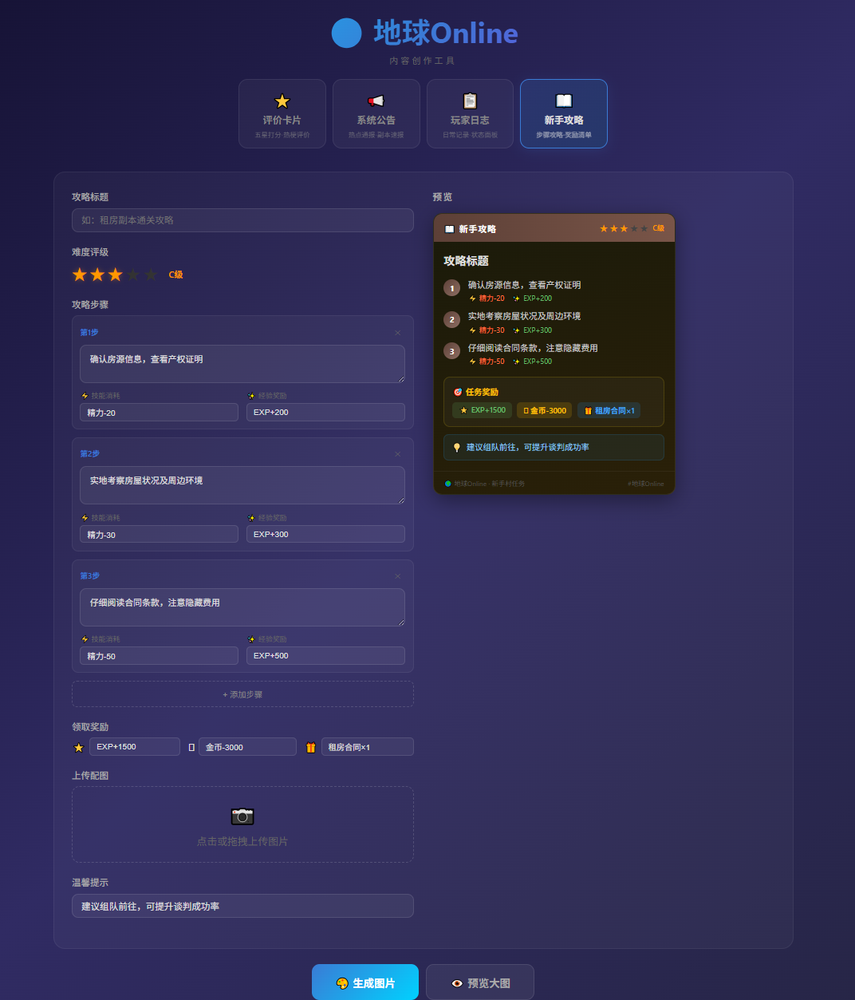

# 🌍 地球Online 内容创作工具

一款基于 Vue 3 的「地球Online」风格图文生成器，用于快速制作游戏化社交媒体内容卡片并导出为图片。

## 功能特性

- **⭐ 评价卡片**：五星打分 + 多标签选择 + 游戏时长 + 评价正文 + 插图 + 自定义昵称
- **📢 系统公告**：支持系统公告 / 副本速报两种类型，含公告时间、难度评级、影响范围等
- **📋 玩家日志**：玩家状态面板，HP/MP 滑块、装备槽、日志内容
- **📖 新手攻略**：步骤式攻略编辑，含难度评级、消耗/奖励、小贴士
- **🎨 一键生成图片**：基于 html2canvas 将预览区渲染为 PNG 并下载
- **👁️ 大图预览**：弹窗查看高清预览图，支持下载

## 技术栈

| 技术 | 说明 |
|------|------|
| Vue 3 | Composition API (`<script setup>`) |
| Vite 5 | 开发与构建工具 |
| html2canvas | DOM 截图导出 |

## 快速开始

```bash
# 安装依赖
npm install

# 启动开发服务器
npm run dev

# 构建生产版本
npm run build

# 预览生产构建
npm run preview
```

开发服务器默认运行在 `http://localhost:5173`。

## 在线访问

[https://earthonline.wg174152.workers.dev/](https://earthonline.wg174152.workers.dev/)

## 项目结构

```
earthOnlineComment/
├── public/
│   └── vite.svg
├── src/
│   ├── main.js
│   ├── App.vue
│   └── components/
│       ├── ReviewCard.vue      # 评价卡片
│       ├── SystemNotice.vue    # 系统公告
│       ├── PlayerLog.vue       # 玩家日志
│       ├── GuideTemplate.vue   # 新手攻略
│       └── ImageUploader.vue   # 图片上传组件
├── scripts/
│   └── generate-copy.mjs       # 文案生成脚本
├── doc/                        # 系统截图
├── index.html
├── vite.config.js
└── package.json
```

## 系统截图

### 评价卡片


### 系统公告



### 玩家日志


### 新手攻略


## License

MIT
